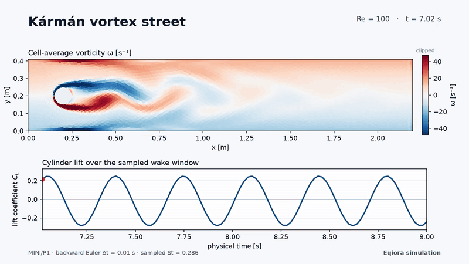

<p align="center">
  <a href="https://eqiora.org"></a>
</p>

<h1 align="center">Eqiora</h1>

<p align="center">
  <strong>Any physics. One language.</strong><br>
  Model and couple physical systems with readable mathematics—and the freedom to choose or build your own numerical methods.<br>
  An open-source computational physics platform. Python for exploration. Rust at the core.
</p>

<p align="center">
  <a href="https://pypi.org/project/eqiora/"></a>
  <a href="https://docs.rs/eqiora/0.1.2/eqiora/"></a>
  <a href="https://github.com/nkiyohara/eqiora/releases"></a>
  <a href="https://pypi.org/project/eqiora/"></a>
  <a href="docs/rust-api.md"></a>
</p>

<p align="center">
  <a href="https://github.com/nkiyohara/eqiora/actions/workflows/ci.yml"></a>
  <a href="https://github.com/nkiyohara/eqiora/actions/workflows/pages.yml"></a>
  <a href="https://eqiora.org"></a>
  <a href="https://eqiora.org/release-notes/"></a>
  <a href="LICENSE"></a>
</p>

<p align="center">
  <a href="#-get-started-with-uv"><strong>Get started</strong></a> ·
  <a href="https://eqiora.org/learn/"><strong>Learn the physics</strong></a> ·
  <a href="https://eqiora.org/gallery/"><strong>Explore simulations</strong></a> ·
  <a href="https://eqiora.org/reference/standard-packages/">Standard library</a> ·
  <a href="https://eqiora.org/reference/">API reference</a> ·
  <a href="docs/roadmap.md">Roadmap</a> ·
  <a href="CONTRIBUTING.md">Contribute</a>
</p>

---

## 🔬 See the physics

**A Kármán vortex street behind a circular obstacle.** This transient
Navier–Stokes example starts with exact channel geometry, advances the wake,
and visualizes cell-average vorticity with Python. Watch the alternating
vortices travel downstream and follow the changing lift below the flow.

[](https://eqiora.org/gallery/karman-vortex-street/)

[Watch the MP4](docs/site/src/assets/gallery/karman-vortex-street.mp4) ·
[Explore the model and run it yourself](https://eqiora.org/gallery/karman-vortex-street/)

| Explore | Inside the walkthrough |
| --- | --- |
| 🎞️ [Kármán vortex street](https://eqiora.org/gallery/karman-vortex-street/) | Transient incompressible flow, vorticity, cylinder force, and pressure observations. |
| 🌊 [Steady flow past a cylinder](https://eqiora.org/gallery/exact-cylinder-steady-stokes/) | Exact geometry, Gmsh meshing, steady Stokes, pressure and boundary observables. |
| 🧱 [Linear elasticity](https://eqiora.org/gallery/mixed-boundary-elasticity/) | A constrained solid, mixed boundary conditions, and a displacement field. |

## ✨ Why Eqiora?

Eqiora is being built around a simple kind of freedom: describe the physics you
care about, combine the models you need, and use the numerical methods that fit
the problem.

- **🌐 One language across physics.** Bring fields, equations, physical
  connections, continuous dynamics, and discrete events into a common
  mathematical model.
- **🔗 Coupling belongs in the model.** Make interactions explicit, from
  connected components to strongly coupled systems whose unknowns must be
  solved together.
- **🛠️ Space for your own numerical methods.** Separate what the equations
  mean from how they are solved—the foundation for changing discretizations,
  integrating a custom solver, or developing a new method.
- **🧮 Mathematics you can read.** Express quantities, units, equations, and
  boundary conditions in Eqiora's domain-specific language (`.eqi`). Keep the
  assumptions visible to the people who read, review, and extend a model.
- **🧩 Models that grow with your work.** Reuse components and constitutive
  laws, compose them into larger systems, and replace individual parts as your
  research or application evolves.
- **🐍 A natural home for computational experiments.** Use Python to build
  geometry, mesh, run simulations, inspect NumPy field data, and make plots.
  Connect the same workflow to your experiment scripts and analysis tools.
- **🦀 Native execution, one shared core.** Python and Rust applications share
  the same mathematical model and execution foundations. Numerical backends
  live alongside that model, keeping physical definitions separate from
  implementation choices.
- **🔎 Calculations you can inspect.** Type and dimension checks catch model
  inconsistencies; explicit plans and typed outputs connect each result to its
  equations, geometry, mesh, and solver settings. Follow examples into their
  source and checks.

## 🚀 Get started with uv

Add the published Python package to your project:

```console
uv add eqiora
```

Prebuilt wheels support Linux x86-64 and ordinary-GIL CPython 3.11–3.14.
Follow [Get started](https://eqiora.org/get-started/) to create a project with
[uv](https://docs.astral.sh/uv/getting-started/installation/), save a small decay
model, and run it. The first model works with the published package; no Rust
compiler or source checkout is needed.

Then choose a subject in [Learn](https://eqiora.org/learn/): mathematical
modeling, heat transfer, numerical simulation, fluid flow, solid mechanics,
circuits and dynamics, or inverse problems. Each path builds the mathematics,
runs the model, and shows how reusable components simplify the same work.

To start with steady flow around a cylinder, open the
[step-by-step walkthrough](https://eqiora.org/gallery/exact-cylinder-steady-stokes/)
and its [complete Python script](examples/python/exact_cylinder_stokes.py).

## 🧩 From a model to a result

The model describes the mathematics. A resolved **Plan** records the numerical
choices. A **Result** carries the outputs and diagnostics of that run.

```text
Equations + Geometry   →   Model   →   Plan   →   Result
                          compile     resolve    run
                                      ↑
                              Mesh · Method · Solver
```

This separation keeps the physical model readable while you experiment with
discretizations and solver policies. Fields and diagnostics remain connected to
the choices that produced them.
Explore the [architecture](docs/architecture.md) for how the pieces fit.

## 🦀 Use from Rust

Add the published facade to a Cargo project:

```console
cargo add eqiora@=0.1.2
```

Start with the [Rust guide](docs/rust-api.md) for model compilation and optional
backends, or browse the [API docs](https://docs.rs/eqiora/0.1.2/eqiora/).

## 🛠️ More ways to work

| Interface | What to reach for |
| --- | --- |
| 🐍 **Python** | The primary simulation API: author, compile, mesh, solve, and plot. [Reference →](https://eqiora.org/reference/python/) |
| 🦀 **Rust** | Embed Eqiora through the `eqiora` Rust crate. [Guide →](docs/rust-api.md) |
| ⌨️ **CLI** | Check a local `.eqi` file with `eqiora check`. [Command reference →](https://eqiora.org/reference/cli/) |
| 📝 **Editor preview** | Diagnostics, formatting, hover, and cross-module navigation through LSP. Currently installed from a source checkout. [Setup →](docs/language-server.md) |

## 🌱 Growing in the open

Eqiora is **pre-1.0 research software**. The current release covers focused paths
through hybrid execution, scalar FEM/FVM, fluid flow, elasticity, implicit
differentiation, and selected CPU/CUDA/MPI adapters. Consult the
[capability matrix](docs/capability-matrix.md) for each method and environment,
and the [benchmarks](docs/benchmarks.md) for reproduced results.

Pre-1.0 APIs evolve without compatibility shims. Eqiora is not certified for
safety-critical or production engineering decisions.

## 🤝 Build with us

Useful bug reports, clearer examples, numerical methods, and improvements to the
developer experience are all welcome. Start with the [contributing guide](CONTRIBUTING.md),
explore the [roadmap](docs/roadmap.md), or [join an issue discussion](https://github.com/nkiyohara/eqiora/issues).

Eqiora is developed in public under the
[Apache License 2.0](LICENSE), with
[DCO sign-off](CONTRIBUTING.md#developer-certificate-of-origin) on contributions.

[Security](SECURITY.md) · [Governance](GOVERNANCE.md) ·
[Release policy](docs/development/python-release-policy.md)
